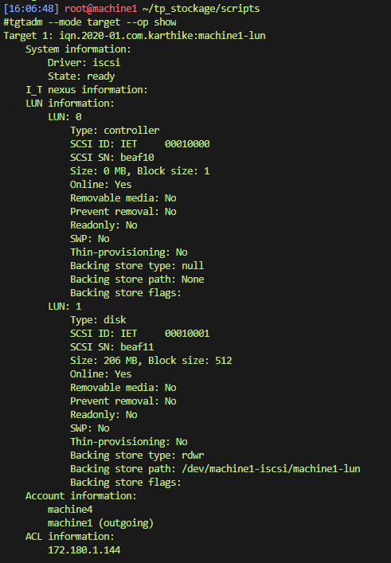
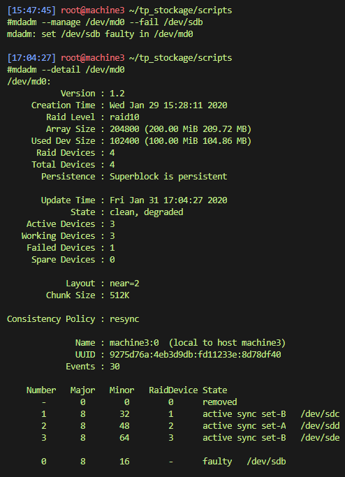

# TP Stockage
TP linux Stockage Raid

## Objectif

- Mettre en œuvre les connaissances sur iSCSI, mdadm, LVM et les systèmes de fichiers.
- Modélisez l'empilement de volumes suivant :<br />
    
- Montez le ISCSI automatiquement au démarrage et configurez l’authentification CHAP
- Créez une dizaine de fichiers de 2Mo à partir de données aléatoires sur chacun des LV.
- Snapshotez le système de fichier LV1, détruisez le fichier précédemment créé et restaurez le.
- Simulez la panne d'un disque sur la machine 3 et son remplacement.

## Prérequis

- 4 machines virtuelles
- l'environnement debian installer sur les 4 machines virtuelles
- activer la connexion ssh pour l'utilisateur `root` (les scripts sont a exécuter en tant que super-utilisateur)
- avoir installer le paquet git (`apt-get install git`)
- :warning: si votre plage d'ip ou votre hostname diffèrent pensez a éditer le script
- machine1:
  - fixer son hostname en `machine1`
  - fixer son adresse ip 172.180.1.141
  - 4 disques de 100mo (en plus de celui sur lequel l'os est installée)
- machine2:
  - fixer son hostname en `machine2`
  - fixer son adresse ip 172.180.1.142
  - 4 disques de 100mo (en plus de celui sur lequel l'os est installée)
- machine3:
  - fixer son hostname en `machine3`
  - fixer son adresse ip 172.180.1.143
  - 4 disques de 100mo (en plus de celui sur lequel l'os est installée)
- machine4:
  - fixer son hostname en `machine4`
  - fixer son adresse ip 172.180.1.144
  - 2 disques de 100mo (en plus de celui sur lequel l'os est installée)

- cloner le projet sur la machine: `git clone https://github.com/KingKami/tp_stockage.git`
- se déplacer dans le répertoire `tp_stockage/scripts/`
  - :warning: ne fonctionnera pas si `$PWD` n'est pas le répertoire ou se trouve le script
- exécuter le script `setup.sh`
  - NOTES: Si le script venait a ne pas fonctionner, il est toujours possible d'exécuter chaque commande en les copiant dans le terminal et en remplaçant les variables par leur valeurs.

## `setup.sh` en détails:

dans un premier temps nous installerons tout les paquets nécessaire au projet:
```bash
IP_MACHINE=("172.180.1.141" "172.180.1.142" "172.180.1.143" "172.180.1.144")                        # on initie un tableau qui va stocker nos adresses ip

apt-get -qq install tgt lvm2 xfsprogs ntfs-3g mdadm open-iscsi                                      # l'option -qq nous permettra de rendre
                                                                                                    # l'installation plus adapter au scripting
                                                                                                    # nous évitant de confirmer pour chaque paquet

if [ -f /dev/sdb ] ; then                                                                           # on répétera cette action pour chacun de nos disques
    sfdisk /dev/sdb < sfdisk-100mb.dump                                                             # sfdisk, qui est un utilitaire similaire a cfdisk
                                                                                                    # mais plus adapter pour automatiser des taches
                                                                                                    # (les affichages sont formaliser afin de savoir ou trouver l'information attendu).
                                                                                                    # sfdisk permet d'exporter la configuration d'un disque et de l'importer a nouveau
                                                                                                    # le fichier tp_stockage/scripts/sfdisk-100mb.dump contient
                                                                                                    # le dump d'un disque de 100mo effectuer au préalable.
fi

if [ "$HOSTNAME" = "machine1" ] || [ "$HOSTNAME" = "machine2" ] || [ "$HOSTNAME" = "machine3" ] ; \
then                                                                                                # on effectue les actions suivante si c'est la machine 1, 2 ou 3
                                                                                                    # $HOSTNAME est une variable d'environnement contenant le nom d'hôte de la machine

    TARGET_CONF_PATH="/etc/tgt/conf.d/${HOSTNAME}-iscsi.conf"                                       # on définit l'emplacement du fichier de configuration de notre target tgt

    mdadm --create /dev/md0 --level=10 --raid-devices=4 /dev/sd[b-e] --run                          #--create /dev/md0 permet de spécifier que l'on crée un raid nommer /dev/md0
                                                                                                    # --level=10 permet de spécifier le niveau du raid
                                                                                                    # --raid-devices=4 permet de spécifier le nombre de disques
                                                                                                    # présent dans la configuration
                                                                                                    # /dev/sd[b-e] permet d'indiquer la plage de disques
                                                                                                    # que nous allons configurer pour le raid
                                                                                                    # --run permet de rentre le montage du raid
                                                                                                    # adapter au scripting en évitant les prompt utilisateur.
    pvcreate /dev/md0                                                                               # on crée un physical volume

    vgcreate "${HOSTNAME}-iscsi" /dev/md0                                                           # on crée un virtual volume

    lvcreate -l 100%FREE --name "${HOSTNAME}-lun" "${HOSTNAME}-iscsi"                               # on crée un logical volume qui sera le lun partager au travers du protocole tgt

    cat target.conf > "${TARGET_CONF_PATH}"                                                         # on écrit le contenu du fichier target.conf
                                                                                                    #dans notre fichier de configuration des target tgt
                                                                                                    # voir la partie sur le fichier target.conf pour plus de details

    sed -i "s#HOSTNAME#$HOSTNAME#g" "${TARGET_CONF_PATH}"                                           # on remplace la chaîne de caractères HOSTNAME
                                                                                                    # par le hostname de la machine dans le fichier de configuration

    service tgt restart                                                                             # on redémarre le service tgt pour que nos modifications soient prises en compte
fi

if [ "$HOSTNAME" = "machine4" ] ; \
then                                                                                                # on effectue ces actions que sur la machine4

    VGNAME="karthike"                                                                               # on définit le nom de notre VG

    XFS_SIZE=200                                                                                    # on définit la taille de notre partition XFS

    EXT4_SIZE=100                                                                                   # on définit la taille de notre partition EXT4

    NTFS_SIZE=50                                                                                    # on définit la taille de notre partition NTFS

    mdadm --create /dev/md0 --level=1 --raid-devices=2 /dev/sd[b-c] --run                           # on crée notre raid 1 de la même façon que nos raid 10 précédemment

    for MACHINE in {0..2}
    do                                                                                              # on effectue les actions suivante pour chaque target
                                                                                                    # a laquelle on souhaite nous connecter

        IP="${IP_MACHINE[$MACHINE]}"                                                                # on récupère l'ip de notre machine depuis le tableau qu'on a initié plus haut

        INDEX=$(($MACHINE+1))                                                                       # $INDEX nous permet de conserver le numero de la machine
                                                                                                    # car notre boucle commence a 0
                                                                                                    # mais nos machine commencent a 1

        NAME="machine${INDEX}"                                                                      # on recompose le nom de la machine

        ISCSI_CONF_PATH="/etc/iscsi/nodes/iqn.2020-01.com.karthike:${NAME}-lun/${IP},3260,1/"       # on définit le chemin du fichier de configuration iscsi

        iscsiadm -m discovery -t st -p "$IP"                                                        # on lance la découverte des target sur chaque ip
                                                                                                    # NOTE: avant de lancer cette discovery les fichiers de configuration
                                                                                                    # iscsi n'existent pas
                                                                                                    # ne surtout pas les créer a la main

        sed -i "s#node.session.auth.authmethod = None#node.session.auth.authmethod = CHAP#" \       # on remplace la méthode d'authentification dans
                                                                                                    # le fichier de configuration qui a ete générer
        "${ISCSI_CONF_PATH}default"

        sed -i "s#manual#automatic#g" "${ISCSI_CONF_PATH}default"                                   # on remplace le démarrage du target qui était en manuel en automatique

        sed -i "s/# END RECORD/node.session.auth.username = machine4/" "${ISCSI_CONF_PATH}default"  # on souhaite rajouter des paramètres en plus le tag de fin nous en empêchant
                                                                                                    # nous le remplaçons par un des nos paramètres

        echo -e "node.session.auth.password = password\n\
        node.session.auth.username_in = ${NAME}\n\
        node.session.auth.password_in = secretpass\n\
        # END RECORD" >> "${ISCSI_CONF_PATH}default"                                                # on écrit le reste de nos paramètres a la fin du fichier
                                                                                                    # sans oublier le tag que nous avons effacer précédemment
                                                                                                    # NOTE: remplacer le fichier en entier par un template préparer a l'avance
                                                                                                    # fait dysfonctionner le service iscsi

        service open-iscsi restart                                                                  # on redémarre le service iscsi pour que le fichier de configuration
                                                                                                    # du target soit recharger

    done                                                                                            # fin de la boucle

    mdadm --create /dev/md1 --level=5 --raid-devices=3 /dev/sd[d-f] --run                           # on crée un nouveau raid de niveau 5 avec nos 3 nouveau disques iscsi

    pvcreate /dev/md0 /dev/md1                                                                      # on crée un nouveau physical volume avec nos 2 disques raid

    vgcreate "${VGNAME}" /dev/md0 /dev/md1                                                          # on crée un nouveau virtual volume nommé avec nos 2 disques raid

    lvcreate -n LV-XFS -L "${XFS_SIZE}" "${VGNAME}"                                                 # on crée un logical volume nommé sur notre virtual volume
    lvcreate -n LV-EXT4 -L "${EXT4_SIZE}" "${VGNAME}"                                               # pour chaque format de partition que l'on souhaite
    lvcreate -n LV-NTFS -L "${NTFS_SIZE}" "${VGNAME}"

    mkfs -t xfs /dev/mapper/${VGNAME}-LV--XFS                                                       # on formate chaque logical volume selon le format qu'on souhaite
    mkfs -t ext4 /dev/mapper/${VGNAME}-LV--EXT4                                                     # XFS, EXT4 ou NTFS
    mkfs -t ntfs /dev/mapper/${VGNAME}-LV--NTFS

    mkdir -p /mnt/xfs-partition /mnt/ext4-partition /mnt/ntfs-partition                             # on crée les répertoires pour monter nos différents logical volume
                                                                                                    # crée précédemment
                                                                                                    # -p permet de créer les répertoire intermédiaire si ils n'existent pas

    mount /dev/mapper/${VGNAME}-LV--XFS /mnt/xfs-partition                                          # on monte chaque logical volume a son point de montage
    mount /dev/mapper/${VGNAME}-LV--EXT4 /mnt/ext4-partition
    mount /dev/mapper/${VGNAME}-LV--NTFS /mnt/ntfs-partition
fi

mdadm --detail --scan >> /etc/mdadm/mdadm.conf                                                      # ces 2 lignes sont exécutés sur les 4 machines
update-initramfs -u                                                                                 # a la toute fin afin que notre configuration raid
                                                                                                    # soit remonter a chaque démarrage
```


## `target.conf` en détails:

```xml
<target iqn.2020-01.com.karthike:HOSTNAME-lun>                                                      <!-- le nom iqn -->
    backing-store /dev/HOSTNAME-iscsi/HOSTNAME-lun                                                  <!-- l'emplacement du disque a partager -->
    initiator-address 172.180.1.144                                                                 <!-- l'adresse ip du hôte ayant de le droit de se connecter-->
                                                                                                    <!-- on restreins l'accès a une whitelist-->
    incominguser machine4 password                                                                  <!-- on définit le username et le password de l'hôte -->
                                                                                                    <!-- qui pourra se connecter a ce target -->
                                                                                                    <!-- pour mettre en place un authentification chap-->
    outgoinguser HOSTNAME secretpass                                                                <!-- on définit le username et le password -->
                                                                                                    <!-- de ce target pour mettre en place un authentification chap-->
</target>
```

## Résultats setup.sh:




## `create_file.sh`

```bash
XFS=/mnt/xfs-partition/                                                                             # on définit les différents chemins ou l'on souhaite créer des fichier
EXT4=/mnt/ext4-partition/                                                                           # aléatoires de 2Mo
NTFS=/mnt/ntfs-partition/

for FILE in {0..9}                                                                                  # nous allons créer 10 fichiers de 0 a 9
do
    dd if=/dev/urandom of="${EXT4}file-${FILE}.txt" bs=2097152 count=1                              # on utilise la commande dd
    dd if=/dev/urandom of="${XFS}file-${FILE}.txt" bs=2097152 count=1                               # if=/dev/urandom permet de créer des fichiers avec un contenu aléatoire
    dd if=/dev/urandom of="${NTFS}file-${FILE}.txt" bs=2097152 count=1                              # of= définit le chemin du fichier a créer
                                                                                                    # bs définit la taille d'un bloc en byte
                                                                                                    # count définit le nombre de fois que l'on souhaite que le bloc se répète
done
```

## résultat create_file.sh


## Snapshot LV1:


## Simulation de panne disque
<br/>
<br/>
<br/>

